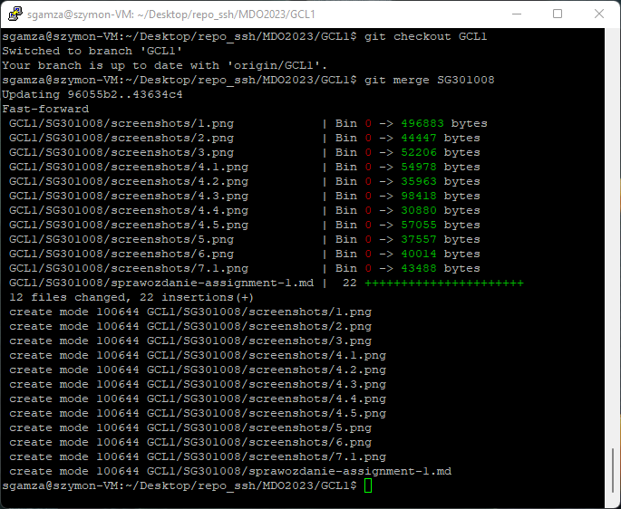

# Sprawozdanie Assignment-1
### 2022-12-10
---
1. Wyka¿ mo¿liwoœæ komunikacji ze œrodowiskiem linuksowym (pow³oka oraz przesy³anie plików)  
  
2. Zainstaluj klienta Git i obs³ugê kluczy SSH  
  
3. Sklonuj repozytorium https://github.com/InzynieriaOprogramowaniaAGH/MDO2023 za pomoc¹ HTTPS  
  
4. Upewnij siê w kwestii dostêpu do repozytorium jako uczestnik i sklonuj je za pomoc¹ utworzonego klucza SSH  
   - Utwórz dwa klucze SSH, inne ni¿ RSA, w tym co najmniej jeden zabezpieczony has³em  
  
  
   - Skonfiguruj klucz SSH jako metodê dostêpu  
  
  
   - Sklonuj repozytorium z wykorzystaniem protoko³u SSH  
  
5. Prze³¹cz siê na ga³¹Ÿ swojej grupy  
  
6. Utwórz ga³¹Ÿ o nazwie "inicja³y & nr indeksu" np. ```KD232144```  
  
7. Rozpocznij pracê na nowej ga³êzi  
  
   - W katalogu w³aœciwym dla grupy utwórz nowy katalog, tak¿e o nazwie "inicja³y & nr indeksu" np. ```KD232144```  
   - W nowym katalogu dodaj plik ze sprawozdaniem  
   - Dodaj zrzuty ekranu  
  
   - Wyœlij zmiany do zdalnego Ÿród³a  
  
  
   - Spróbuj wci¹gn¹æ swoj¹ ga³¹Ÿ do ga³êzi grupowej  
  
   - Zaktualizuj sprawozdanie i zrzuty o ten krok i wyœlij aktualizacjê do zdalnego Ÿród³a (na swojej ga³êzi)  
  
   - Oznacz tagiem ostatni commit i wypchnij go na zdaln¹ ga³¹Ÿ  
  
   - Ustal hook, który bêdzie sprawdza³, czy wiadomoœæ z commitem zawiera nazwê przedmiotu  
  
  
   - W jaki sposób stworzyæ hook, który bêdzie *ustawia³* prefiks wiadomoœci commitu tak, by mia³ nazwê przedmiotu?  
  
  
  
### Weryfikacja dzia³ania œrodowiska konteneryzacji  
1. Rozpocznij przygotowanie œrodowiska Dockerowego  
    * zapewnij dostêp do maszyny wirtualnej przez zdalny terminal (nie "przez okienko")  
    * je¿eli nie jest stosowane VM (np. WSL, Mac, natywny linux), wyka¿ ten fakt **dok³adnie**  
    * zainstaluj œrodowisko dockerowe w stosowanym systemie operacyjnym  
2. Dzia³anie œrodowiska  
    * wyka¿, ¿e œrodowisko dockerowe jest uruchomione i dzia³a (z definicji)  
    * wyka¿ dzia³anie z sposób praktyczny (z w³asnoœci):  
      * pobierz obraz dystrybucji linuksowej i uruchom go  
      * wyœwietl jego numer wersji  
  
5. Za³ó¿ konto na Docker Hub lub zaloguj siê do ju¿ posiadanego. Zadbaj o 2FA.  
  