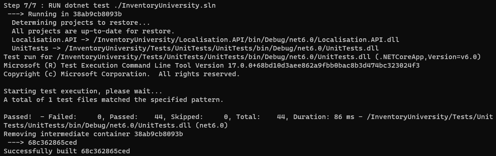

# Zajêcia 02  
## Zestawienie œrodowiska  
1. Zainstaluj Docker w systemie linuksowym  
  
2. Zarejestruj siê w Docker Hub i zapoznaj z sugerowanymi obrazami  
  
3. Pobierz hello-world, busybox, ubuntu lub fedorê, mysql  
  
4. Uruchom busybox  
   - Poka¿ efekt uruchomienia kontenera  
  
   - Pod³¹cz siê do kontenera interaktywnie i wywo³aj numer wersji  
  
5. Uruchom "system w kontenerze"  
   - Zaprezentuj PID1 w kontenerze i procesy dockera na hoœcie  
  
  
   - Zaktualizuj pakiety  
  
   - WyjdŸ  
Komenda "exit"  
6. Poka¿ uruchomione ( != "dzia³aj¹ce" ) kontenery, wyczyœæ je.  
  
  
7. WyczyϾ obrazy  
  

## Budowanie programu  
1. ZnajdŸ projekt umo¿liwiaj¹cy ³atwe wywo³anie testów jednostkowych  
  
2. PrzeprowadŸ budowê/konfiguracjê œrodowiska  
  
  
  
3. Uruchom testy  
  
4. Ponów ten proces w kontenerze  
   - Wybierz i uruchom platformê  
Wybrano ubuntu:latest  
   - Zaopatrz j¹ w odpowiednie oprogramowanie wstêpne  
  
  
   - Sklonuj aplikacjê  
  
   - Skonfiguruj œrodowisko i uruchom build  
  
  
   - Uruchom testy  
  
5. Stwórz Dockerfile, który ma to osi¹gn¹æ  
   - Na bazie platformowego obrazu...  
FROM ubuntu
   - ...doinstaluj wymagania wstêpne...  
RUN apt update && apt -y upgrade && apt install -y git dotnet-sdk-6.0  
   - ...sklonuj repozytorium...  
RUN git clone {repo URL}  
   - ...zbuduj kod  
RUN dotnet restore ./InventoryUniversity.sln  
RUN dotnet build ./InventoryUniversity.sln  
6. Zaprezentuj Dockerfile i jego zbudowanie  
  
  
  
  
7. Na bazie obrazu utworzonego poprzednim dockerfilem stwórz kolejny, który bêdzie uruchamia³ testy  
  
 	* Kontener pierwszy ma przeprowadzaæ wszystkie kroki a¿ do builda  
  
	* Kontener drugi ma bazowaæ na pierwszym i wykonywaæ testy  
  
## Runda bonusowa: kompozycja  
  
  
1. Zdefiniuj kompozycjê, która stworzy dwie us³ugi  
   - Pierwsz¹ na bazie dockerfile'a buduj¹cego  
   - Drug¹ na bazie pierwszej  
  
2. Wdró¿ :)  
     