## Assignment 3
## Pipeline, Jenkins, izolacja etapów

### Przygotowanie
* Zapoznaj siê z instrukcj¹ instalacji Jenkinsa: https://www.jenkins.io/doc/book/installing/docker/
  * Uruchom obraz Dockera który eksponuje œrodowisko zagnie¿d¿one  
Wyczyœci³em `DOCKER_TLS_CERTDIR=""` w celu u¿ycia HTTP a nie HTTPS (z nim by³y problemy).  
```
sudo docker run \
  --name jenkins-docker \
  --rm \
  --detach \
  --privileged \
  --network jenkins \
  --network-alias docker \
  --env DOCKER_TLS_CERTDIR="" \
  --volume jenkins-docker-certs:/certs/client \
  --volume jenkins-data:/var/jenkins_home \
  --publish 2376:2376 \
  docker:dind \
  --storage-driver overlay2
```
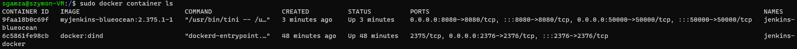  
  * Przygotuj obraz blueocean na podstawie obrazu Jenkinsa  
Dockerfile do build'u:  
```dockerfile
FROM jenkins/jenkins:2.375.1
USER root
RUN apt-get update && apt-get install -y lsb-release
RUN curl -fsSLo /usr/share/keyrings/docker-archive-keyring.asc \
  https://download.docker.com/linux/debian/gpg
RUN echo "deb [arch=$(dpkg --print-architecture) \
  signed-by=/usr/share/keyrings/docker-archive-keyring.asc] \
  https://download.docker.com/linux/debian \
  $(lsb_release -cs) stable" > /etc/apt/sources.list.d/docker.list
RUN apt-get update && apt-get install -y docker-ce-cli
USER jenkins
RUN jenkins-plugin-cli --plugins "blueocean:1.26.0 docker-workflow:563.vd5d2e5c4007f"
```
  * Uruchom Blueocean  
Czyszczê `DOCKER_HOST=""`, `DOCKER_TLS_VERIFY=""` i `DOCKER_CERT_PATH=""` w celu u¿ycia HTTP  

```
docker run \
  --name jenkins-blueocean \
  --restart=on-failure \
  --detach \
  --network jenkins \
  --env DOCKER_HOST="" \
  --env DOCKER_CERT_PATH="" \
  --env DOCKER_TLS_VERIFY="" \
  --publish 8080:8080 \
  --publish 50000:50000 \
  --volume jenkins-data:/var/jenkins_home \
  --volume jenkins-docker-certs:/certs/client:ro \
  myjenkins-blueocean:2.375.1-1 
```
  * Zaloguj siê i skonfiguruj Jenkins  
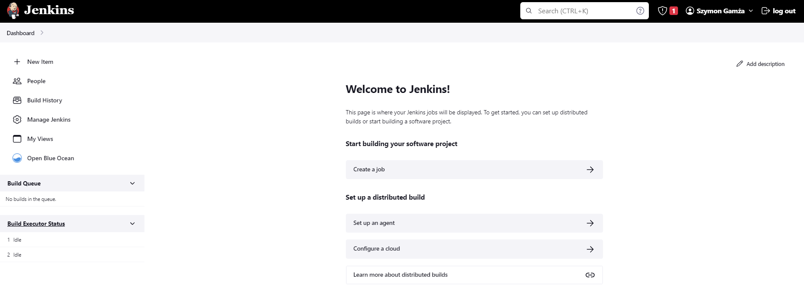  
Skonfigurowa³em po³¹czenie z kontenerem dind:  
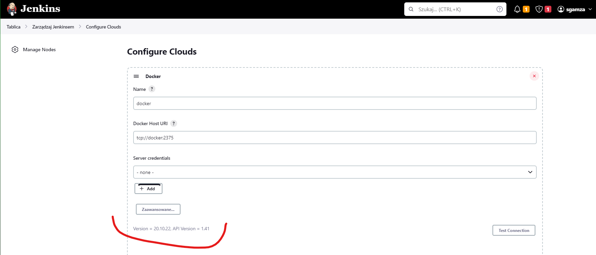  
  
### Uruchomienie 
* Konfiguracja wstêpna i pierwsze uruchomienie  
  * Utwórz projekt, który wyœwietla uname  
Przechodzimy do `New Item`.  
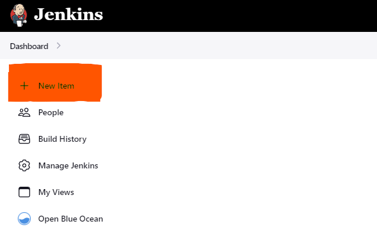  
Wpisujemy nazwê projektu i wybieramy typ `Freestyle project`:  
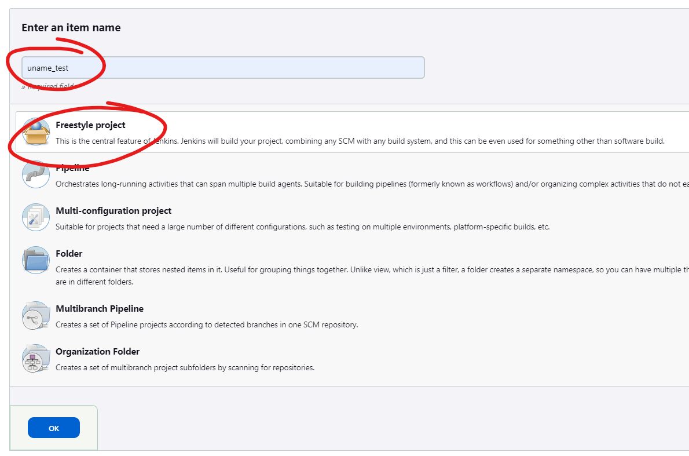  
W celu konfiguracji przechodzimy do kroku `Build Steps` (na screenie jest ma³y b³¹d) i wybieramy Build step `Execute shell`:    
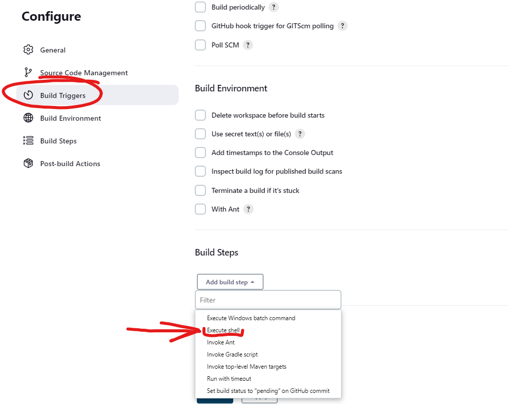  
W oknie input boxie wpisujemy komendê która ma siê wykonaæ, w tym wypadku `uname -a`:  
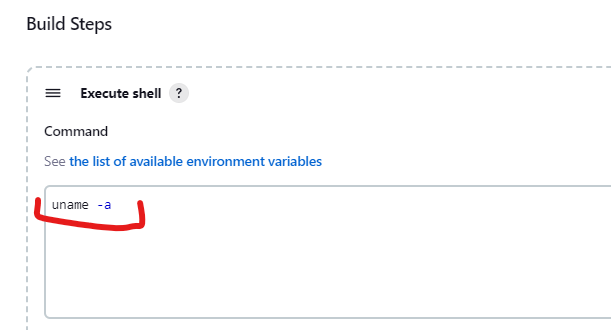  
W celu uruchomienia klikamy `Build Now`:  
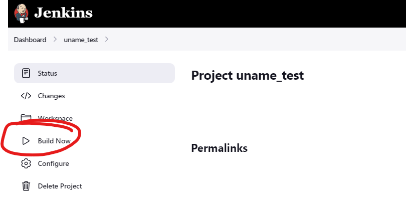  
Efektem jest uruchomienie build'u, które s¹ numerowane. PrzejdŸmy do wykonanego build'u:  
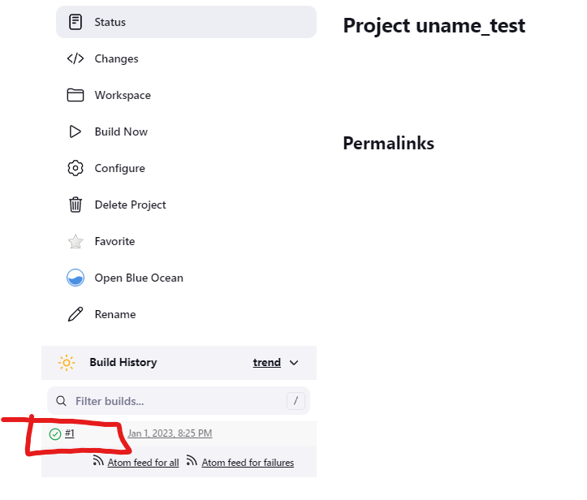
Nastêpnie aby zobaczyæ wynik komendy przechodzimy do `Console Output`:  
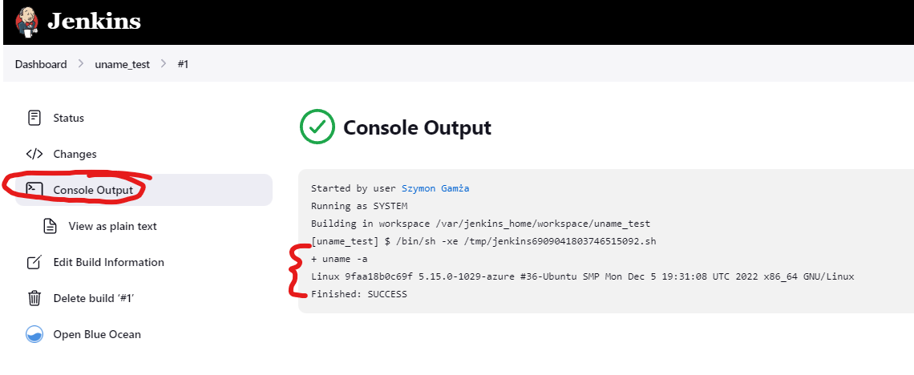  
  * Utwórz projekt, który zwraca b³¹d, gdy... godzina jest nieparzysta  
W tym celu tworzymy projekt jak poprzednim razem, zmieniamy jedynie wykonywany skrypt:  
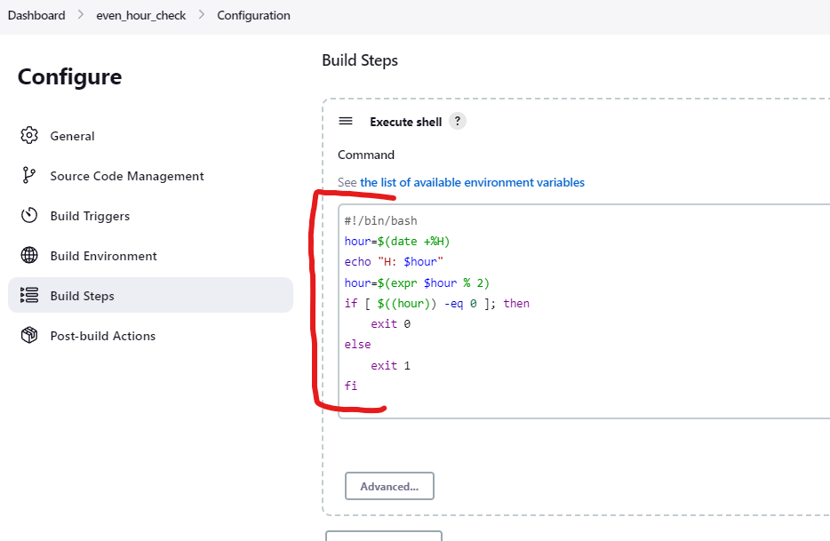  
Dodatkowo doda³em Schedule `H/30 * * * *` w celu uruchamiania build'u co 30 min:  
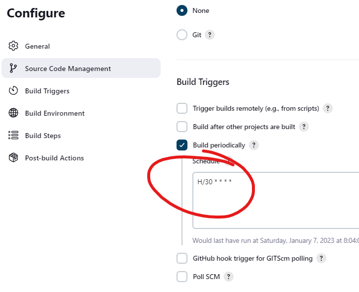  
Wynik build'ów:  
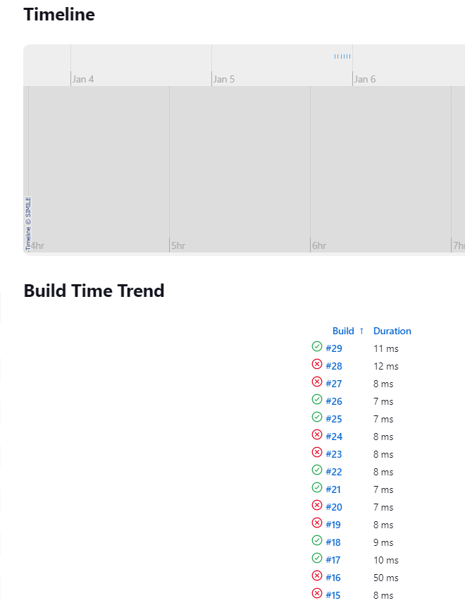  
* Utwórz "prawdziwy" projekt, który:  
  * klonuje nasze repozytorium  
  * przechodzi na osobist¹ ga³¹Ÿ  
Powy¿sze podpunkty realizujemy poprzez opcjê w konfiguracji projektu `Source Code Management` gdzie wstawiamy URL repozytorium oraz jego ga³¹Ÿ:  
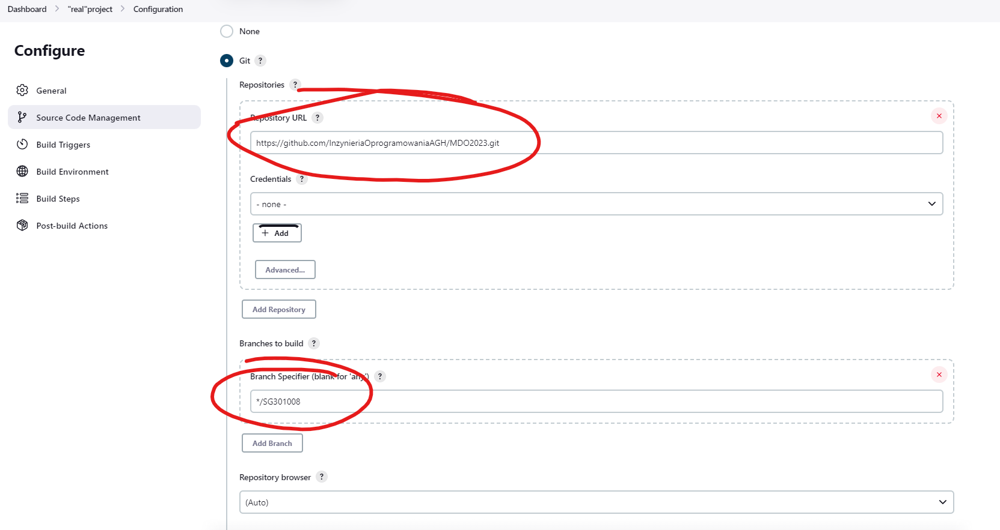  
  * buduje obrazy z dockerfiles i/lub komponuje via docker-compose  
Skrypt odpowiadaj¹cy za budowanie i testy:  
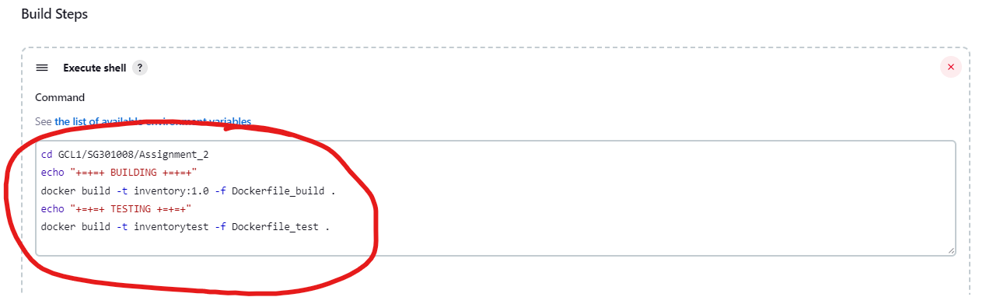  
Wynik builda w konsoli:  
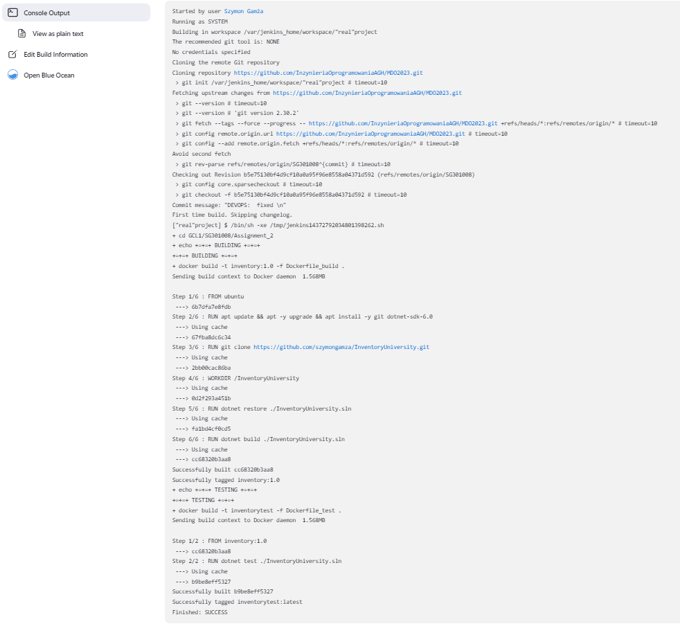  
  
### Pipeline
Diagram aktywnoœci:  
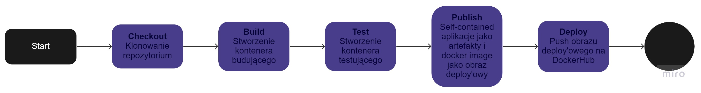  
* Checkout - klonuje swoje repozytorium `https://github.com/szymongamza/DevOpsJenkinsTry`  
* Build - uruchamia kontener który buduje moj¹ aplikacjê. Jako obrazu bazowego u¿ywa `mcr.microsoft.com/dotnet/sdk:7.0`  
* Test - uruchamia kontener który testuje moj¹ aplikacjê. Jako obrazu bazowego u¿ywa obraz buduj¹cy z poprzedniego stage'a  
* Publish - buduje moj¹ aplikacjê pod kilka platform w wersji `--self-contained` jako artefakty, w celu ³atwego uruchomienia starych wersji aplikacji bez martwienia siê o dependencje. W celu ³atwego wdra¿ania, budujê dodatkowy obraz posiadaj¹cy aplikacjê w formie `framework-dependent binary` oparty na obrazie runtime `mcr.microsoft.com/dotnet/aspnet:7.0`, pozwala to na dowoln¹ cross-platformowoœæ i ³atwy deploy.  
* Deploy - przes³anie obrazu do docker hub'a.  
Diagram wdro¿eniowy:  
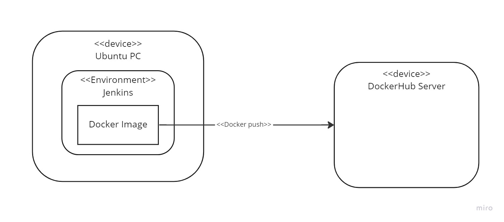  
Wdro¿eniem u mnie jest, przes³anie obrazu do Docker Hub'a z œrodowiska Jenkins.  
Tak wygl¹da konfiguracja Pipeline'a w Jenkins:  
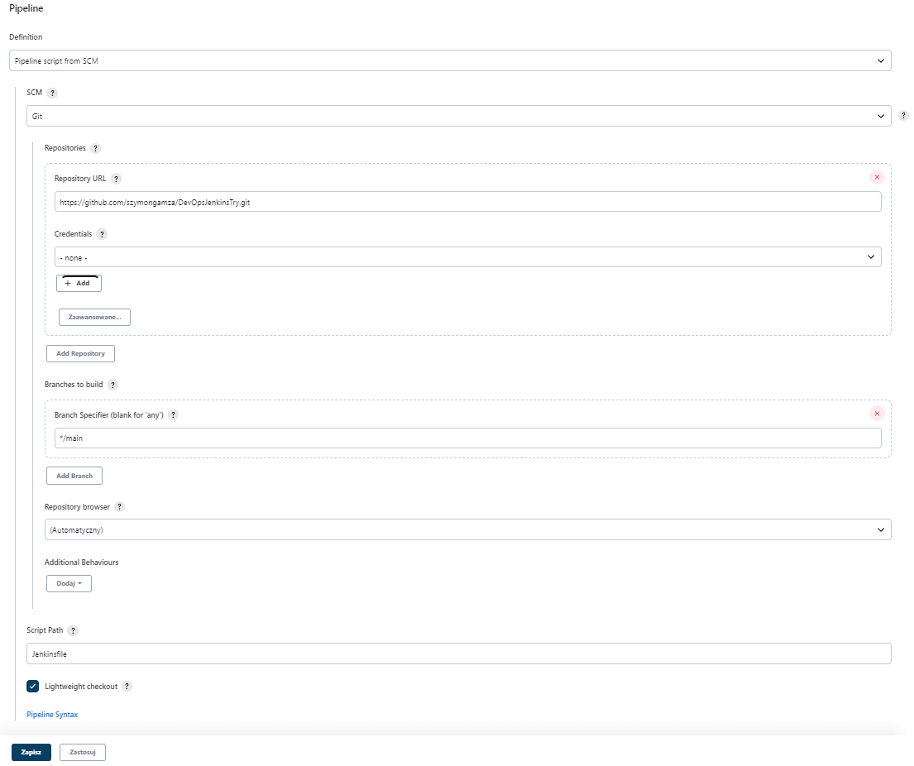  
Tak wygl¹da repozytorium z plikami `Jenkinsfile` oraz przydatnymi `Dockerfile`:  
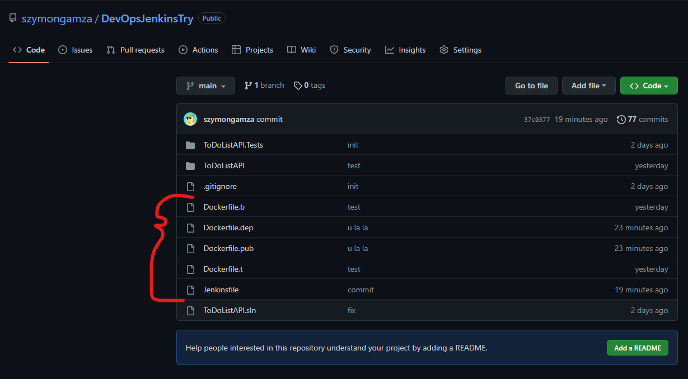  
Jenkinsfile:  
```Jenkinsfile
pipeline {
    agent any
    environment{
        DOCKERHUB_CREDENTIALS=credentials('851b9618-d12c-4037-97ab-61baa8600146')
    }
    stages {
        stage('Checkout') {
            steps {
                git url:'https://github.com/szymongamza/DevOpsJenkinsTry.git', branch: 'main'
            }
        }
        stage('Build') {
            steps {
                sh 'docker build -f Dockerfile.b  -t image_build .'
            }
        }
        stage('Test') {
            steps {
                sh 'docker build -f Dockerfile.t -t image_test .'
            }
        }
        stage('Publish') {
            steps {
                sh """
                    docker build -f Dockerfile.pub -t image_publish .
                    docker run -d --name temp_cont --tty image_publish
                    docker cp temp_cont:/app/publish/ ./artifacts
                    docker rm -f temp_cont
                """
                zip zipFile: './artifacts/win-x64.zip', archive: false, dir: './artifacts/win-x64'
                tar file: './artifacts/linux-x64.tar', archive: false, dir: './artifacts/linux-x64'
                tar file: './artifacts/osx-x64.tar', archive: false, dir: './artifacts/osx-x64'
                archiveArtifacts artifacts: 'artifacts/win-x64.zip', fingerprint: true
                archiveArtifacts artifacts: 'artifacts/linux-x64.tar', fingerprint: true
                archiveArtifacts artifacts: 'artifacts/osx-x64.tar', fingerprint: true
                sh 'docker build -f Dockerfile.dep -t szymongamza/todolist:latest .'
                sh 'rm -r ./artifacts'
            }
        }
        stage('Deploy') {
            steps {
                sh 'echo $DOCKERHUB_CREDENTIALS_PSW | docker login -u $DOCKERHUB_CREDENTIALS_USR --password-stdin'
                sh 'docker push szymongamza/todolist:latest'
            }
        }
    }
    post {
		always {
			sh 'docker logout'
		}
	}
}
```
Dockerfile.b:  
```Dockerfile.b
FROM mcr.microsoft.com/dotnet/sdk:7.0
COPY . .
RUN ls
RUN dotnet restore ToDoListAPI.sln
RUN dotnet build ToDoListAPI.sln
```
Dockerfile.t:  
```Dockerfile.t
FROM image_build
RUN dotnet test ToDoListAPI.sln
```
Dockerfile.pub:  
```Dockerfile.pub
FROM image_test
RUN dotnet publish "./ToDoListAPI.sln" -c Release -o /app/publish/dockerize
RUN dotnet publish -r win-x64 --self-contained true "./ToDoListAPI.sln" -c Release -o /app/publish/win-x64
RUN dotnet publish -r linux-x64 --self-contained true "./ToDoListAPI.sln" -c Release -o /app/publish/linux-x64
RUN dotnet publish -r osx-x64 --self-contained true "./ToDoListAPI.sln" -c Release -o /app/publish/osx-x64
```
Dockerfile.dep:  
```Dockerfile.dep
FROM mcr.microsoft.com/dotnet/aspnet:7.0
EXPOSE 80
WORKDIR /app
COPY ./artifacts/dockerize/ .
ENTRYPOINT ["dotnet", "ToDoListAPI.dll"]
```
Tak wygl¹da uruchomiony build w pipeline'ie. Aktualnie mój build pozostawia 3 artefakty (oprócz loga), `linux-x64.tar`,`osx-x64.tar` oraz `win-x64.zip`. Zadba³em aby rozszerzenie archiwum odpowiada³o platformie:  
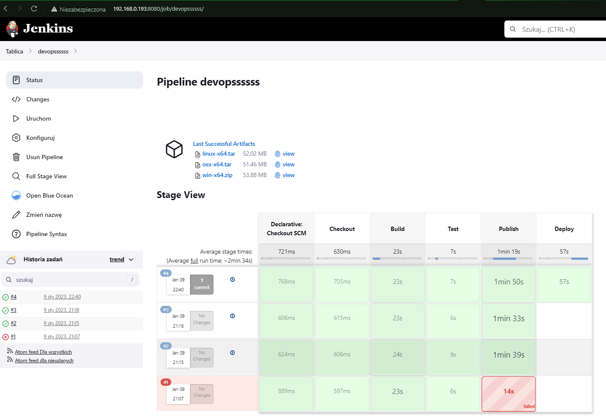  
W pipeline u¿y³em stepów u³atwiaj¹cych archiwizowanie plików, nale¿¹ one do pluginu `Pipeline Utility Steps`:  
```
zip zipFile: './artifacts/win-x64.zip', archive: false, dir: './artifacts/win-x64'
tar file: './artifacts/linux-x64.tar', archive: false, dir: './artifacts/linux-x64'
tar file: './artifacts/osx-x64.tar', archive: false, dir: './artifacts/osx-x64'
```
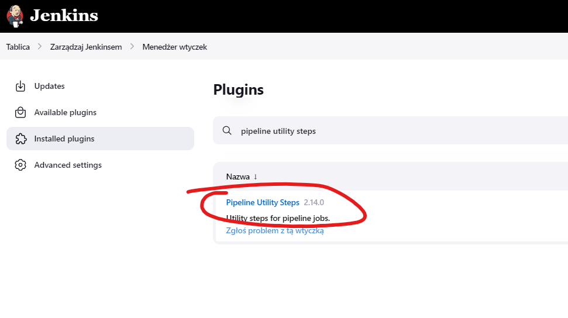  
Efekt stage'u Deploy:  
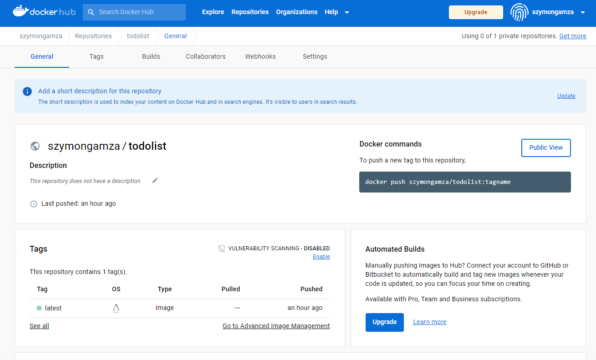  
W pipeline w celu Deploy'u muszê zalogowaæ siê do DockerHub -> Doda³em poœwiadczenia do Jenkins:  
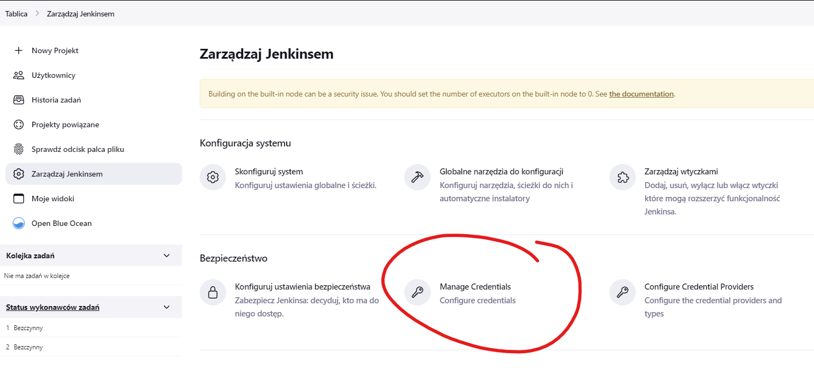  
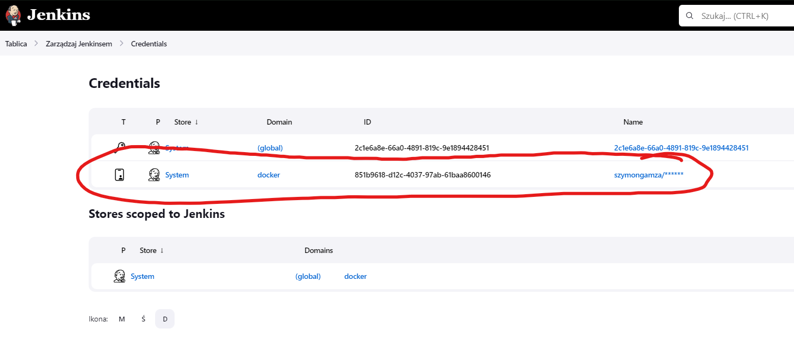  
