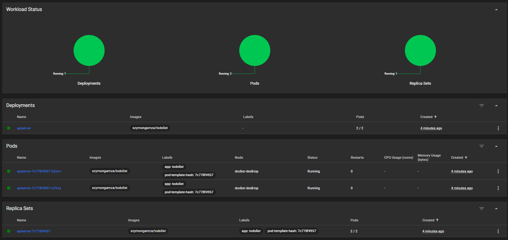
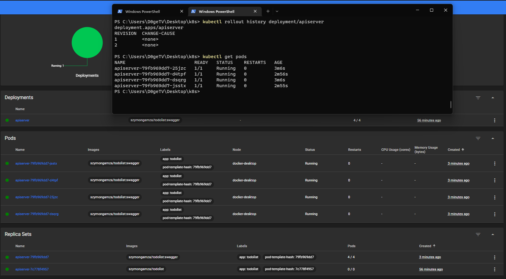

## Assignment 4
## K8s

### Przygotowanie
Postanowi³em zamiast minikube wykorzystaæ Kubernetesa dostarczanego wraz z Docker Desktop na systemie Windows 11 (YOLO)  
W Docker Desktop uruchamiam wsparcie Kubernetes:
  
Nastêpnie w PowerShell przypisalem docker-desktop jako context dla Kubernetesa:
```
kubectl config get-contexts
```
Wyswietla dostepne contexty - miedzy innymi pojawilby sie tu minikube
```
kubectl config use-context docker-desktop
```
Wskazuje docker-desktop jako context.  
Default'owo Dashboard dla Kubernetes'a nie jest zdeployowany zatem:
```
kubectl apply -f https://raw.githubusercontent.com/kubernetes/dashboard/v2.7.0/aio/deploy/recommended.yaml
```
Za pomoca komendy `kubectl proxy` uruchamiamy proxy, ktore umozliwi uruchomienie dashboard'u w przegladarce. Bedzie dostepny pod linkiem:
```
http://localhost:8001/api/v1/namespaces/kubernetes-dashboard/services/https:kubernetes-dashboard:/proxy/
```
Rezultat:  
  
Musimy uwierzytelnic polaczenie. Ja uzyje sposobu z Tokenem.  
Instrukcja tworzenia konta i uzyskania Tokena:  
`https://github.com/kubernetes/dashboard/blob/master/docs/user/access-control/creating-sample-user.md`  
Rezultat:  
  
### Wdrozenie reczne
Z poprzednich zajec posiadam zbudowany obraz w skutek pipeline'u: `szymongamza/todolist`  
Sprobujmy go uruchomic! Uzywam komendy:
```
kubectl run apiserver --image=szymongamza/todolist --port=80 --labels app=apiserver
```
Rezultat:  
  
  
Node stworzony i ma sie dobrze.  
Nastepnie wykonalem port-forwarding w celu uzyskania dostepu z zewnatrz do uruchomionej aplikacji:
```
kubectl port-forward apiserver 8000:80
```
Przy pomocy programu Postman (www.postman.com) wykorzystuje jeden z endpointow API:
  
### Wdrozenie deklaratywne YAML
Przygotowanie pliku YAML `eploy-apiserver.yaml`:  
```
apiVersion: apps/v1
kind: Deployment
metadata:
  name: apiserver
spec:
  selector:
    matchLabels:
      app: todolist
  replicas: 2 # tells deployment to run 2 pods matching the template
  template:
    metadata:
      labels:
        app: todolist
    spec:
      containers:
      - name: todolist
        image: szymongamza/todolist
        ports:
        - containerPort: 80
```
I uruchamiam przy pomocy komendy: `kubectl apply -f .\deploy-apiserver.yaml`
Rezultat:  
  
Nastepnie zwiekszylem ilosc replik `replicas: 2` -> `replicas: 4` i ponownie `kubectl apply`  
 Rezultat:
  
### Zmiany w deploymencie
Zmiana wersji obrazu oraz wyswietlenie historii wersji przy pomocy komendy `kubectl rollout history deployment/apiserver`:
  
Zmiana na `replicas: 0`:
  
### Kontrola wdrozenia
Ustawienie skryptu weryfikujacego czy wdrozenie "zdazylo" sie wdrozyc (60sek):
```
kubectl patch deployment/apiserver -p '{"spec":{"progressDeadlineSeconds":60}}'
```
### Strategie wdrozenia
* Recreate - "ubija" wszystkie dzialajace pody z wersja poprzednia i uruchamia nowe z nowa wersja.  
```
apiVersion: apps/v1
kind: Deployment
metadata:
  name: apiserver
spec:
  selector:
    matchLabels:
      app: todolist
  replicas: 2
  strategy:
    type: Recreate
  template:
    metadata:
      labels:
        app: todolist
    spec:
      containers:
      - name: todolist
        image: szymongamza/todolist:swagger
        ports:
        - containerPort: 80
```
* Rolling Update - tworzony jest drugi ReplicaSet z nowsza wersja. Nastepnie redukowana jest ilosc starych podow i uzupelniane sa o nowe z nowsza wersja az wszystkie zostana wymienione.
```
apiVersion: apps/v1
kind: Deployment
metadata:
  name: apiserver
spec:
  selector:
    matchLabels:
      app: todolist
  replicas: 2 
  strategy:
    type: RollingUpdate
    rollingUpdate:
      maxSurge: 2
      maxUnavailable: 0  
  template:
    metadata:
      labels:
        app: todolist
    spec:
      containers:
      - name: todolist
        image: szymongamza/todolist:swagger
        ports:
        - containerPort: 80
```